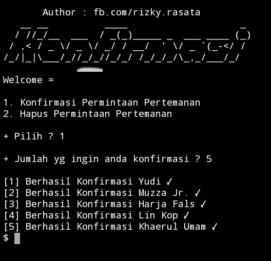
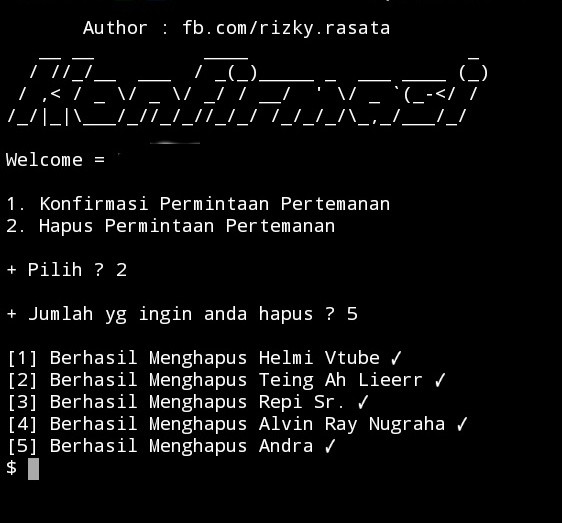

AUTO ACCEPT FRIEND REQUEST
AUTO REMOVE FRIEND REQUEST
LOGIN COOKIES ONLY

# INSTALL
 `pkg update && upgrade`

 `pkg install python2`

 `pkg install git`

 `pip2 install requests`

 `pip2 install bs4`

 `git clone https://github.com/RIZKY4/konfir`

 `cd konfir`

 `python2 konfir.py`

# SCREENSHOT

